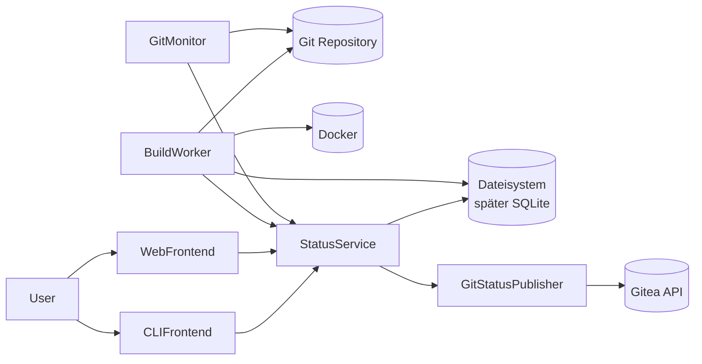

# GitTally – Konzept und Architekturübersicht

## Motivation

GitTally ist ein bewusst minimalistisches und stark opinionated Continuous-Integration-System (CI), das später um Continuous Delivery (CD) erweitert werden kann.

Ziel ist es, die Komplexität klassischer CI-Systeme wie Jenkins erheblich zu reduzieren und stattdessen einen einfachen, nachvollziehbaren und git-zentrierten Ansatz zu verfolgen.

## Grundprinzipien

- Git wird immer verwendet.
- Builds laufen in Docker.
- Die Konfiguration erfolgt primär über YAML-Dateien.
- Eine Instanz verwaltet zunächst genau ein Repository.
- Build-Status werden an das Git-System zurückgemeldet.

## Betriebsarten

### CLI-Modus

- Interaktive Nutzung
- Status anzeigen
- Konfiguration anzeigen
- Initialisierung durchführen

### Server-Modus

- HTTP-Weboberfläche
- Betrieb hinter Nginx möglich
- Dauerbetrieb auf einer VM oder einem Server

## Architekturdiagramm



## Komponenten

### GitMonitor

- git fetch
- Branch-Erkennung
- Commit-Erkennung
- Erzeugen neuer Buildaufträge

### StatusService

- Verwaltung aller Builds
- Buildhistorie
- Recovery nach Neustarts
- Zentrale Wahrheit des Systems

### BuildWorker

- Pending-Build übernehmen
- Worktree anlegen
- Commit auschecken
- Build starten
- Artefakte sammeln
- Worktree entfernen

### GitStatusPublisher

- Pending melden
- Success melden
- Failure melden

### WebFrontend

- Status anzeigen
- Historie anzeigen
- Artefakte anbieten
- Builds neu starten

### CLIFrontend

- Status anzeigen
- Konfiguration anzeigen
- Initialisierung durchführen

## Buildmodell

### Commit-basierte Builds

GitTally baut immer einen konkreten Commit und niemals nur einen Branchnamen.

### Worktree pro Build

Jeder Build erhält einen eigenen temporären Worktree.

## Konfigurationsmodell

1. Eingebaute Defaults
2. Globale Server-Konfiguration
3. Repository-Installation (.git/gittally/config.yml)
4. Projektkonfiguration (.gittally.yml)
5. Branchprofile

## Bootstrapping

### Voraussetzungen

- Java Runtime
- Git Repository
- Ausgecheckter Workspace
- GitTally JAR

### Initialisierung

```bash
java -jar gittally.jar init
```

### Serverstart

```bash
java -jar gittally.jar server
```

### Konfigurationsanzeige

```bash
java -jar gittally.jar config:print
java -jar gittally.jar config:print --full
```

## Erweiterungen

- Deployment / CD
- SQLite statt Dateisystem
- Mehrere BuildWorker
- Multi-Repository-Verwaltung
- Weitere Git-Plattformen
