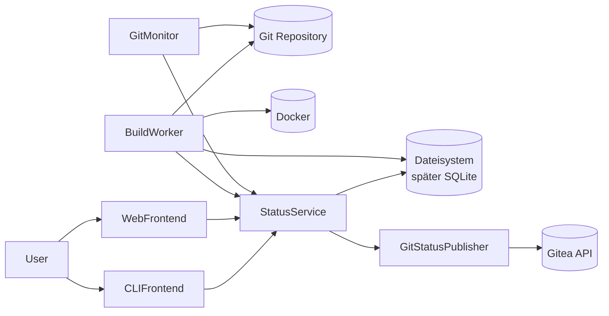

# Werkator – Konzept und Architekturübersicht

## Motivation

Werkator ist ein bewusst minimalistisches und stark opinionated Continuous-Integration-System (CI), das später um Continuous Delivery (CD) erweitert werden kann.

Ziel ist es, die Komplexität klassischer CI-Systeme wie Jenkins erheblich zu reduzieren und stattdessen einen einfachen, nachvollziehbaren und git-zentrierten Ansatz zu verfolgen.

## Grundprinzipien

- Git wird immer verwendet.
- Builds laufen nativ oder optional in Docker (pro Branch konfigurierbar).
- Die Konfiguration erfolgt primär über YAML-Dateien.
- Eine Instanz verwaltet zunächst genau ein Repository.
- Build-Status werden an das Git-System zurückgemeldet.

## Betriebsarten

### CLI-Modus

- Interaktive Nutzung
- Status anzeigen
- Builds starten und wiederholen
- Konfiguration anzeigen
- Initialisierung durchführen

### Server-Modus

- HTTP-Weboberfläche
- Betrieb hinter Nginx möglich
- Dauerbetrieb auf einer VM oder einem Server

## Architekturdiagramm



## Komponenten

### GitMonitor

- git fetch
- Branch-Erkennung
- Commit-Erkennung
- Erzeugen neuer Buildaufträge

### StatusService

- Verwaltung aller Builds
- Buildhistorie
- Recovery nach Neustarts
- Zentrale Wahrheit des Systems

### BuildWorker

- Pending-Build übernehmen
- Branch-Worktree anlegen oder wiederverwenden
- Commit auschecken
- Build starten
- Artefakte sammeln
- Worktrees entfallener Branches entfernen

### GitStatusPublisher

- Pending melden
- Success melden
- Failure melden

### WebFrontend

- Status anzeigen
- Historie anzeigen
- Artefakte anbieten
- Builds neu starten

### CLIFrontend

- Status anzeigen
- Builds starten und wiederholen
- Konfiguration anzeigen
- Initialisierung durchführen

## Buildmodell

### Commit-basierte Builds

Werkator baut immer einen konkreten Commit und niemals nur einen Branchnamen.
Buildergebnisse werden intern trotzdem pro Branch geführt: derselbe Commit auf zwei Branches ergibt zwei getrennte Builds mit eigenem Status, eigenen Artefakten und eigenem Worktree.
Das ist gewollt, weil Buildläufe den Branchnamen einbeziehen können (Umgebungsvariable `branch`).
In Gitea hängt der Commit-Status dagegen am Commit-SHA: zeigen zwei Branches auf denselben Commit, überschreiben sich ihre Statusmeldungen gegenseitig (der zuletzt gemeldete gewinnt).
Falls das je stört, kann der Branchname später in den Status-Context aufgenommen werden (z. B. `werkator/main`), sodass ein Commit mehrere unabhängige Statuszeilen bekommt.

### Worktree pro Branch

Jeder Branch erhält einen eigenen, wiederverwendeten Worktree unter `.git/werkator/worktrees/<branchKey>`.
Der Branch-Key ist der dateisystem-sicher bereinigte Branchname plus 12 Zeichen SHA-256 des Originalnamens (z. B. `main-0d6e4079e367`).
Der Hash schützt nur vor Kollisionen durch die Bereinigung (`feature/x` vs. `feature_x`); der Commit ist bewusst nicht Teil des Keys, damit das Verzeichnis über alle Builds des Branches stabil bleibt.
Der zu bauende Commit wird darin detached ausgecheckt.
Der primäre Checkout wird niemals für Builds verwendet.
Die Wiederverwendung erhält inkrementelle Build-Caches; das `cleanCommand` des Branches bestimmt, wie viel davon überlebt.

### Parallele Builds

Mehrere Branches können gleichzeitig bauen (`builds.maxConcurrent`, Default 1).
Pro Branch läuft höchstens ein Build gleichzeitig.
Ein neuer Build desselben Branches wartet, bis der laufende fertig ist.
Ob ein neuer Commit den laufenden Build seines Branches stattdessen abbrechen soll, wird später entschieden und ist möglicherweise konfigurierbar.

## Konfigurationsmodell

1. Eingebaute Defaults
2. Globale Server-Konfiguration
3. Repository-Installation (.git/werkator/.werkator.yml)
4. Projektkonfiguration (.werkator.yml)
5. Branchprofile

## Bootstrapping

### Voraussetzungen

- Java Runtime
- Git Repository
- Ausgecheckter Workspace
- Werkator JAR

### Initialisierung

```bash
java -jar build/libs/werkator.jar init
```

### Serverstart

```bash
java -jar build/libs/werkator.jar server
```

Für den Dauerbetrieb als systemd-User-Service siehe [deployment.md](deployment.md) (`init --systemd`).

### Konfigurationsanzeige

```bash
java -jar build/libs/werkator.jar config:print
java -jar build/libs/werkator.jar config:print --full
```

## Erweiterungen

- Continuous Delivery (CD; das Deployment von Werkator selbst ist in [deployment.md](deployment.md) beschrieben)
- SQLite statt Dateisystem
- Mehrere BuildWorker
- Multi-Repository-Verwaltung
- Weitere Git-Plattformen
